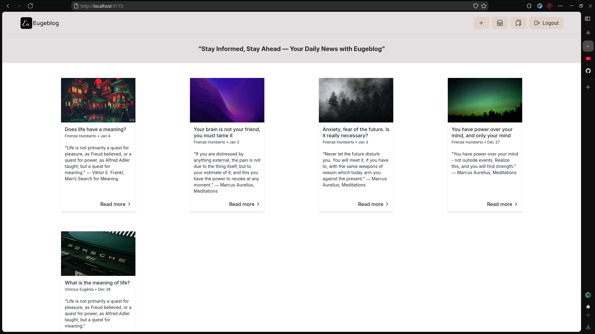
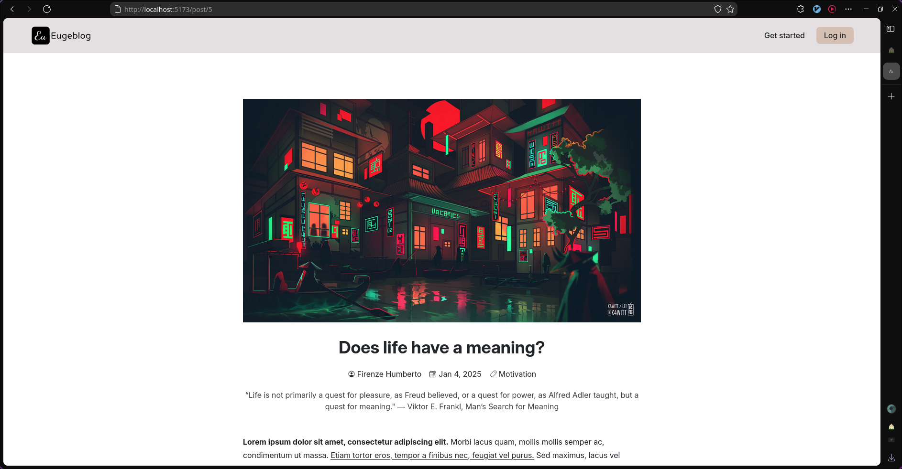
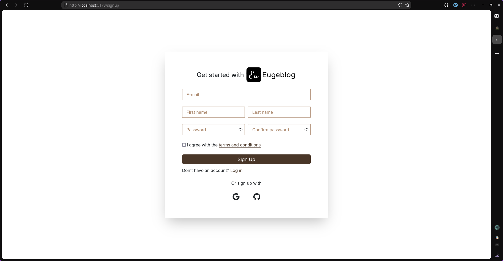

## <p align='center'>“Stay Informed, Stay Ahead — Your Daily News with Eugeblog”</p>

<p align='center'>
  
</p>

A full-stack application made with Django and React.js. A side project for you to post thoughts, news or reflections.

## Project Status

This project is currently in development. I still pretend to enhance and add a lot of other features.

- [x] Functionality to list and create new posts.
- [x] Possibility to bookmark posts and see them in the main navbar.
- [x] Buttons in PostDetails to edit/delete a post, displayed conditionally if the user is post reviewer or the owner.
- [x] Section to add comments if the user is authenticated.
- [x] Social login & sign up with GitHub and Google.
- [x] New posts sent for approval by the post reviewers before being posted
- [x] Dynamic pagination in bookmarks dropdown and main page.
- [x] Custom authentication with JWT tokens.
- [x] Post creation with rich-text editor (react-quill) for more beautiful posts.
- [x] Functionality to edit the post
- [ ] Page for posts reviewers to see posts that are pending.
- [ ] Functionality to search for posts.
- [ ] Functionality to delete or edit comments.
- [ ] Password reset functionality.
- [ ] Implement responsiveness.
- [ ] Coverage with test, in both back-end and front-end.
- [ ] Deploy the application.

If you have a suggestion of a new feature to implement, contact me. It will be a pleasure to see your side and develop it!

## Project Screen Shots





## Installation and Setup Instructions

Clone down this repository. You will need `node`, `npm`, `python3` and `mysql` installed globally on your machine.

Go to the folder of the project, and install the packages from front-end:

```
cd frontend
npm install
```

To run the front-end server, the command is `npm run dev`.

For the back-end you will need to create a virtual environment and active it before installing everything.

```
cd backend
python3 -m venv venv
. venv/bin/active (Linux, varies from OS)
pip install -r requirements.txt
```

To run the back-end server, you can do it with `python manage.py runserver`

After all of that, you just have to configure the environment variables, both front-end and back-end have an .env-example file where you just have to duplicate and place your own values.

Be open and comfortable to send PR's and suggestions for me to analyze the code and learn with your implementations! I'm sure you have something new to teach me.

## Reflection

For the main part of 2024 I was focused on learning front-end related tools: HTML & CSS, JavaScript and finally React.js. This made my experiences as a Django developer weaker as the time passed. How I was learning React, I decided to put my newly learned framework into practice so I could better understand and internalize it. Then, I embarked on the journey and enhanced a lot my abilities with Django and especially with React.js.

This project does not have any defined deadline, as I'm taking my time to understand and learn better the technologies that I'm using, as well to choose the best options so I can take the best out of this project. I still have a lot to learn with everything, and this project is just a proof of my resilience and hunger for knowledge. It allowed me to understand features that before I saw no usability, and to strengthen my previously learned ability and skills with the used technologies.

One of the main challenges that I ran into was authentication. I had never did or seen any implementation of authentication with Django and React.js, and I wanted to do so with JWT tokens and HTTPOnly cookies. This led me to spend a few days understanding JWT implementation and how HTTPOnly cookies worked. I managed to implement it, although obviously, wasn't nearly ideal and optimal (as everything we do for the first time). After some time I managed to enhance and made use of Django middlewares and the DRF default authentication class.

I also had never implemented social accounts on my own, as with Django I could use django-allauth. When I decided to make this a full-stack application, I decided that I was going to make the social authentication on my own, as I thought django-allauth was too complicated. This made me read GitHub and Google documentations so I could make the most optimal implementation of authentication with these tools.

The technologies I have used in this project, in the front-end, are React, React Router V7, sonner for notifications for its beautiful UI and simplicity of use, Material UI for the simple CircularProgress component, and TanStack Query for more optimized queries and mutations. For the back-end I have used [djangorestframework-simplejwt](https://github.com/jazzband/djangorestframework-simplejwt/tree/master) , because of its easy extensibility, great features and lightness.
